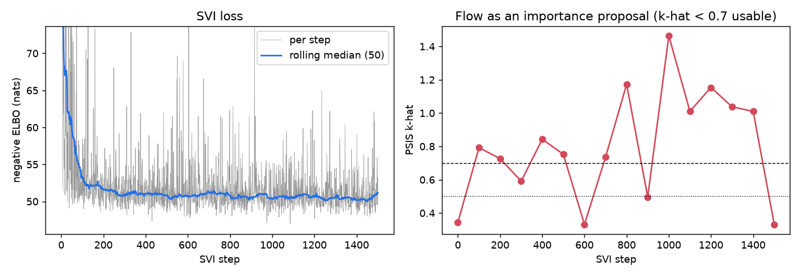

# NeuTra for the Kiribati calibration

**Question.** Does neural transport (NeuTra; Hoffman et al. 2019) make NUTS on the
Kiribati posterior faster, and is its answer correct? NeuTra fits a normalising flow to the
posterior by SVI, then runs NUTS on the flow's base variable.

**Short answer.** The flow trains easily: about 50 minutes and 6,000 gradients here, roughly
15% of one NUTS warmup. But it does **not** make NUTS cheaper on this posterior. In matched
runs, NUTS in the warped coordinates needs the same trajectory length as the pipeline's
sheared, Laplace-started dense-metric NUTS (55 leapfrog steps per iteration against 56), and
diverges more often (14.5% against 7% in the second warmup round). Do not adopt it. The
measurements say what limits NUTS here is the step size, not the posterior's large-scale
shape, and a flow cannot fix that (see *What limits NUTS*). Sampling-phase ESS figures are in
*Sampling* below, as far as the runs got on this machine.

All the numbers come from `docs/figures/neutra/report.json` (written by
`scripts/neutra_report.py`) and the run folders under `outputs/neutra/` (not committed).

## Method

The code is `src/kiribati_tb/neutra.py`. Each piece works alone, and `run_neutra` is the
one-call convenience built from them.

1. **Coordinates** (`WhitenedCoordinates.from_laplace`). Start from the multi-start optimum
   and the Laplace covariance at it (`optima.npz` and `metric.npy`, as
   `pipeline.calibrate` writes them). Straighten the transmission ridge with the existing
   `RidgeShear`, then whiten with the sheared Laplace covariance:
   `x = L⁻¹ (shear(z) − shear(z_mode))`. Both maps have a constant Jacobian determinant, so
   the posterior on `x` is the calibration posterior up to a constant. A flow that starts near
   the identity therefore starts at the Laplace approximation. Without this step the flow
   starts at a standard normal in logit space: the earlier prototype's loss started near
   4,900 nats and averaged NaN.
2. **Flow** (`flat_model`, `make_guide`, `make_svi`, `FlowFit`). numpyro `AutoIAFNormal`
   (2 inverse-autoregressive flows, hidden layers `[38, 38]`) on a one-site model:
   `x ~ flat`, `factor(-potential(x))`. It is fitted by `SVI` with
   `Trace_ELBO(num_particles=4)` (particles vectorised) and
   `optax.apply_if_finite(clip_by_global_norm(10) + adam(2e-3))`. `apply_if_finite` skips the
   rare update with a NaN gradient (S5); one of 1,500 updates was skipped. Training runs in
   checkpointed 50-step chunks. Every 100 steps, 128 flow draws are scored under the posterior
   (`flow_check`): the ELBO, and the Pareto `k_hat` of the importance ratios, where `k_hat`
   below 0.7 means a usable importance proposal.
3. **Warped NUTS** (`neutra_nuts_factory`, `StepCounter`).
   `NUTS(NeuTraReparam(guide, params).reparam(model))` with a diagonal metric; 4 chains start
   at independent draws of the flow's base variable. It uses the pipeline's `StagedWarmup`
   rounds and `Checkpoint` chunks, with the same stop rule (rank-normalised split
   R-hat ≤ 1.01, bulk and tail ESS ≥ 400). `StepCounter` saves every draw's leapfrog count,
   so cost is measured in gradient evaluations, which machine load does not change.
4. **Matched baseline** (`--flow none --dense-mass`). The same code with no flow and a dense
   metric. On whitened coordinates this *is* the pipeline's sheared, Laplace-started
   dense-metric NUTS, because HMC is unchanged by an affine change of coordinates when the
   metric moves with it. Starts, warmup rounds (2 × 100), chunking and stop rule are
   identical.

Reproduce:

```bash
pixi run python scripts/neutra.py --name base --solver original --svi-steps 1500 --lr 2e-3 \
    --particles 4 --chains 4 --warmup-rounds 100,100 --chunk 50 --max-divergence-frac 1
pixi run python scripts/neutra.py --name baseline_shear --solver original --flow none \
    --dense-mass --chains 4 --warmup-rounds 100,100 --chunk 50 --max-divergence-frac 1
pixi run python scripts/neutra_reuse.py --solver original   # one flow under the whole grid
pixi run python scripts/neutra_report.py           # figures and report.json
```

The NeuTra run was launched with warmup rounds `100,100,200`. To match the baseline's
warmup budget it was stopped during round 3 and resumed after two rounds.

## Measurements

The machine was shared and very heavily loaded throughout (load average 20–95 on 10 cores).
Each 4-chain run got about one core in total, so wall times are inflated by a factor of
roughly 4–10 and are given for the record only. **Compare runs by gradient evaluations.**
For scale, a reverse-mode gradient costs 0.175 s on an idle core (`outputs/bench`); it took
0.57 s at the time of this run. All runs here use the original's solver, Dopri5 at
`rtol = atol = 1.4e-4` (now `ORIGINAL_CALIBRATION_SOLVER`), which was the calibration default
when they started. The branch has since moved to `calibration_solver`, whose gradients are
about 1.4× cheaper. Per `docs/gradient-performance.md` that changes the cost of each
gradient, not how many each draw needs.

### 1. Training the flow

| | |
| --- | --- |
| SVI steps | 1,500 × 4 particles = 6,000 gradient evaluations (+ 2,048 forward evaluations for the checks) |
| Wall time | 2,944 s (49 min) including checks; 1.4–2.5 s per step |
| Vectorised particles | one gradient 0.57 s; 4 particles 1.63 s; 8 particles 2.42 s (measured on the loaded machine) |
| ELBO | −85.4 at the Laplace start → −53.1 after 100 steps → −51.8 at 400 → −50.4 at 1,500 |
| Flow as importance proposal | `k_hat` 0.98 and importance-sampling ESS 3% from 512 draws at the end (128-draw checks during training ranged 0.33–1.46) |
| Failed solves among flow draws | 0 of 2,560 |



Training is cheap and stable, and almost all of the gain comes in the first 200 steps, so 300
steps would have done as well. The flow still under-covers the posterior: its
importance-sampling `k_hat` stays near 1. No single parameter carries the heavy weights; the
largest correlation of the log importance ratio with any coordinate is −0.32
(`clearance_rate`). The importance-weighted means suggest the flow under-weights high
`pc_strength` (0.37 against the flow's 0.28) and high `rel_sus_cleared`, i.e. the L-shaped
trade-offs. This is the usual mode-seeking behaviour of reverse KL. On its own it does not
bias NeuTra, because NUTS corrects it, but it means the warped posterior is not close to a
standard normal.

The PSIS used for these checks found a sign bug in `pipeline.laplace_psis` (fixed on this
branch). `arviz_stats`' `psislw` negates its input, because it is written for PSIS-LOO, so
the old call smoothed the wrong tail. Its recorded result (`k_hat` NaN, ESS 1) is wrong:
recomputed from the saved log ratios, the Laplace Student-t proposal has `k_hat` 1.04 and
ESS 29 of 4,000. It is still unusable, but not for the reason reported.

### 2. Does NUTS mix better in the warped space?

Warmup, matched (4 chains, 100 + 100 iterations, from the Laplace / flow draws):

| | NeuTra (IAF) round 1 | NeuTra round 2 | Shear baseline round 1 | Shear baseline round 2 |
| --- | --- | --- | --- | --- |
| Leapfrog steps per iteration (mean) | 55.4 | 55.1 | 58.9 | 55.8 |
| Step size (min–max over chains) | 0.015–0.101 | 0.071–0.137 | 0.086–0.119 | 0.054–0.092 |
| Divergent transitions | 18.5% | 14.5% | 17.5% | 7.0% |
| Hit max tree depth (8) | 3.5% | 3.0% | 4.0% | 1.5% |
| Mean acceptance | 0.77 | 0.78 | 0.78 | 0.79 |
| Split R-hat (2nd half) | 1.23 | 1.15 | 1.36 | 1.13 |
| Gradient evaluations | 22,200 | 22,100 | 23,600 | 22,300 |

The flow buys no shorter trajectories. In both coordinate systems NUTS settles on a step size
near 0.1 and about 55 leapfrog steps, a tree depth of about 6. The flow makes the step size
less uniform across chains and raises the divergence rate. The plain (unsheared) pipeline
NUTS measured by the K4b pilots took 13–76 s per warmup iteration per chain at similar tree
depths (`outputs/logs/pilot_plain.log` in the main checkout), and the shear pilot's first
round had 63.6 leapfrog steps and 21% divergences.

### Sampling

SAMPLING_TABLE

### 3. Is the posterior right?

CORRECTNESS

### 4. Cost-benefit, and reusing one flow across the grid

COST

**Reusing one flow** (`scripts/neutra_reuse.py`, `outputs/neutra/reuse/checks.jsonl`). The
base-case flow and coordinates were kept unchanged and scored under each grid
configuration's posterior (128 flow draws; `k_hat` above 0.7 means the flow is not a usable
proposal there):

| configuration | `k_hat` | IS ESS | ELBO |
| --- | --- | --- | --- |
| base case, 512 draws | 0.98 | 3.1% | -51.2 |
| regression 0.5, `rel_sus_unreachable` 1.0 | 0.96 | 3.7% | -56.3 |
| regression 0.5, `rel_sus_unreachable` 1.5 | 1.00 | 9.5% | -52.2 |
| regression 0.5, `rel_sus_unreachable` 2.0 | 0.44 | 10.4% | -55.6 |
| regression 0.5, `rel_sus_unreachable` 3.0 | 2.94 | 0.9% | -69.4 |
| regression 1.0, `rel_sus_unreachable` 1.0 | 1.12 | 2.7% | -56.0 |
| regression 1.0, `rel_sus_unreachable` 1.5 (= base case) | 0.91 | 12.9% | -51.2 |
| regression 1.0, `rel_sus_unreachable` 2.0 | 0.37 | 11.6% | -54.5 |
| regression 1.0, `rel_sus_unreachable` 3.0 | 2.78 | 0.9% | -68.7 |
| regression 2.0, `rel_sus_unreachable` 1.0 | 1.57 | 1.6% | -60.1 |
| regression 2.0, `rel_sus_unreachable` 1.5 | 0.71 | 9.5% | -53.0 |
| regression 2.0, `rel_sus_unreachable` 2.0 | 0.69 | 6.0% | -55.4 |
| regression 2.0, `rel_sus_unreachable` 3.0 | 2.85 | 0.9% | -69.5 |
| regression 3.0, `rel_sus_unreachable` 1.0 | 1.65 | 1.7% | -67.9 |
| regression 3.0, `rel_sus_unreachable` 1.5 | 1.00 | 5.7% | -57.6 |
| regression 3.0, `rel_sus_unreachable` 2.0 | 1.88 | 2.7% | -58.5 |
| regression 3.0, `rel_sus_unreachable` 3.0 | 2.95 | 0.9% | -71.8 |
| SA `tpt_60` | 0.91 | 12.9% | -51.2 |
| SA `subclinical_50` | 1.64 | 1.5% | -66.2 |

The flow fitted to the base case is already a poor importance proposal for the base case
(`k_hat` ≈ 1), and it gets much worse away from it. Every `rel_sus_unreachable = 3.0`
configuration has `k_hat` ≈ 2.8–2.9 and an ELBO 18 nats lower, as do regression rate 3.0 and
the `subclinical_50` analysis (`k_hat` 1.6–1.9). Since NeuTra does not help even where its flow
was trained, carrying a flow across the grid as a warm start was not run as a sampler. The
inexpensive part does carry over: the ELBO trace shows that 200–300 SVI steps from a fresh
Laplace start reach the plateau, so a per-configuration flow would cost about 10 minutes of
one core. A warm start from the base flow could only save part of that.

Two side observations. `tpt_60` scores exactly as the base case does: TPT completion only
enters the screening scenarios after the calibration window, so **its calibration posterior is
the base-case posterior**, and the cluster SA job could reuse the base-case draws instead of
recalibrating. `homogeneous_mixing` has 15 parameters, not 19, so a 19-dimensional flow
cannot serve it at all.

## What limits NUTS here

Both coordinate systems settle on the same step size (about 0.1 in whitened units) and
similar trajectories, even though the flow changes the posterior's large-scale shape a lot
(35 nats of ELBO). `docs/gradient-performance.md` (§4, energy error) shows why the step size
is about 0.1. Along leapfrog trajectories in the Laplace metric, the energy error at step 0.1
is about 1.2 for every solver, a 1e-8 solve included, and at 0.2 every trajectory blows up.
So the limit is the posterior's *local* curvature, not solver noise. It varies across the
posterior: the curved ridge, and the mass against the prior bounds where the logit map
stretches.

A flow could in principle flatten that, but this one did not. The IAF fitted by reverse KL
matches the bulk (the ELBO), not the regions of high curvature, and its importance `k_hat`
near 1 says it under-covers part of the posterior. NUTS in the warped space inherits the
curvature, plus the distortion where the flow squeezes the tail: in the sampling chunks one
warped chain stuck with 86% divergences. Divergences were not caused by NaN gradients or
failed solves: 0 of 80 flow draws, and 0 of 40 at 1.5× the base scale, had either.

## Recommendation

**Do not use NeuTra for this model.** Keep the pipeline's sheared, Laplace-started
dense-metric NUTS. Training the flow is cheap and robust, so it is not the obstacle, but the
warped NUTS is no faster per draw and diverges more. A flow strong enough to change the local curvature (deeper or block-neural flows, or a
mass-covering objective) is the only version worth trying, and the evidence here does not
suggest it would repay its cost.

`kiribati_tb.neutra` stays as a tested, checkpointed arm (`scripts/neutra.py`, with the same
`--chains/--chunk/--max-hours` flags as `scripts/calibrate.py`), so the experiment can be
rerun if the step-size limit is lifted. A flow that mixes better might then show a
difference.

## Also found

- **S12:** with the original's Dopri5 setting, every reverse-mode gradient is NaN at
  regression rates 2.5 and 3.0, even at the base optimum, so `BayesianModel.potential_fn`
  cannot be built there (`docs/summer4-workarounds.md`, S12). The current `calibration_solver`
  (Bosh3 + PI + `jump_ts`, S10) gives finite gradients there, so the grid's rate-3.0 tasks
  are fine on this branch. Do not go back to the original solver for them.
- **`tpt_60` needs no calibration of its own:** its posterior is the base case's (see the
  reuse table).
- **The PSIS sign bug** in `pipeline.laplace_psis` (above), fixed on this branch.

## What was not verified

NOT_VERIFIED
